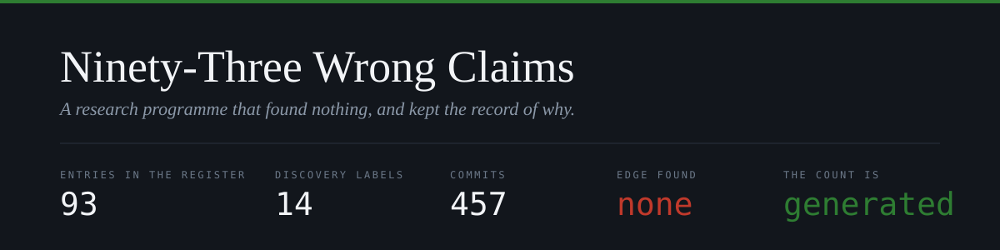
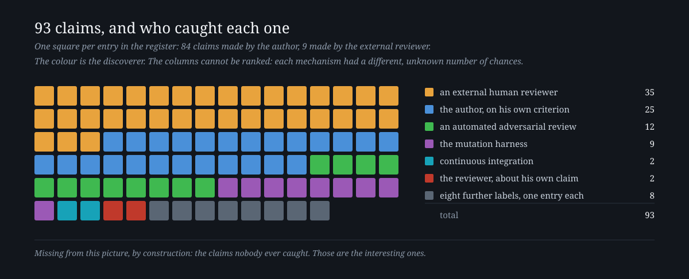
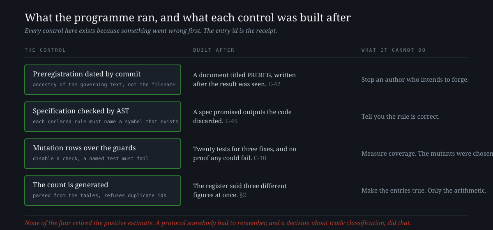

<p align="center">
  
</p>

<p align="center">
  <a href="https://github.com/Lostmanu/ninety-three-wrong-claims/actions/workflows/register.yml"></a>
  
  
  
  
  
</p>

---

A one-person quantitative research programme kept a register of every claim it made that later turned out to
be false, together with who or what caught each one. It looked for a trading edge in crypto perpetual futures
and did not find one.

**The register is what it found instead.** This repository holds the register, the paper that analyses it,
and the tool that counts it. The laboratory itself — code, guards, preregistrations and rulings — is in
[**quant-system**](https://github.com/Lostmanu/quant-system).

> **How this was made.** One person ran the programme working with AI systems, which wrote the code, audited
> it and account for part of the entries in this register. The paper gives no proportion, because the
> record does not attribute individual entries to a named person or system; it records who or what caught
> each one. Section 10 of the paper describes the assistance.

---

## Run it yourself

Nothing to install. Both tools parse the register's own tables: one prints the tally, the other draws the figure.

```bash
git clone https://github.com/Lostmanu/ninety-three-wrong-claims
cd ninety-three-wrong-claims
python tools/recuento_auditoria.py --check   # the tally
python tools/figura_registro.py --check       # the figure below
```

<p align="center">
  
</p>

<details>
<summary>The same numbers, as a table</summary>

<br>

<table>
<tr><th align="left">who or what caught it</th><th align="right">entries</th></tr>
<tr><td>an external human reviewer</td><td align="right">35</td></tr>
<tr><td>the author, on his own criterion, most often by re-measuring</td><td align="right">25</td></tr>
<tr><td>an automated adversarial review</td><td align="right">12</td></tr>
<tr><td>the mutation harness</td><td align="right">9</td></tr>
<tr><td>continuous integration</td><td align="right">2</td></tr>
<tr><td>the reviewer, about his own claim</td><td align="right">2</td></tr>
<tr><td>eight further labels, one entry each</td><td align="right">8</td></tr>
<tr><td><b>total</b></td><td align="right"><b>93</b></td></tr>
</table>

</details>

The register's own tally is never typed: the counter regenerates it from the tables and refuses to run if
two entries share an id, and [`tools/figura_registro.py`](tools/figura_registro.py) draws the squares from
the same parse. The badges and the folded table on this page are transcriptions, and nothing checks them. [Both are checked on every push](.github/workflows/register.yml): if a row
changes and either one goes stale, the build says so. That control exists because the count once said three
different figures at once in the same document, and an external reviewer caught it by counting the rows
himself. Both facts are entries in the register.

---

## The controls, and what each one was built after

<p align="center">
  
</p>

---

## What you are looking at

The programme asked one question about crypto perpetual-futures microstructure: whether a slow participant,
on a rented server with about 113 ms of median feed latency, could extract systematic edge. The versioned
record runs from 12 June 2026 to 9 September 2026, across 457 commits.

It produced one positive estimate. A frozen adversarial protocol, written months earlier and invoked by hand
for the first time in two months, destroyed it on 24 August 2026. A later re-analysis widened an admission
rule that the protocol had already flagged as an open sensitivity, and the estimate fell from about +18 basis
points to about +3, and went negative in the primary cell. The programme retired it and stopped.

None of that is unusual. What is unusual is that somebody wrote down all ninety-three times the programme was
wrong, while it was happening, with the discoverer named.

---

## The limits, before you read further

<table>
<tr><td valign="top"><b>1</b></td><td><b>93 is the denominator of what was recorded</b>, not of errors made, and not of the chances each mechanism had to catch something. The errors nobody found are absent by construction, and those are the interesting ones.</td></tr>
<tr><td valign="top"><b>2</b></td><td><b>One laboratory, one annotator</b>, and the annotator is one of the parties. No inter-rater agreement.</td></tr>
<tr><td valign="top"><b>3</b></td><td><b>No control group.</b> Nobody has built the same system twice, so this cannot show that one method finds more defects than another. The figure above ranks nothing.</td></tr>
<tr><td valign="top"><b>4</b></td><td><b>The detection method is recorded for 25 of the 93.</b> The other 68 name only the discoverer.</td></tr>
<tr><td valign="top"><b>5</b></td><td><b>One account authored all the commits</b>, so the repository alone cannot attribute a change to one party.</td></tr>
<tr><td valign="top"><b>6</b></td><td><b>The register stops on 28 August 2026</b> while the work continued to 9 September. Claims found and corrected after that date are not in it.</td></tr>
<tr><td valign="top"><b>7</b></td><td><b>The market data is not included</b>, out of licence prudence, so the trading result is not reproducible from here. The register, the count and the tool are.</td></tr>
</table>

---

## What is here

| path | what it is |
|---|---|
| [`register/`](register/AUDITORIA_DEL_METODO.md) | the register, in Spanish, as it was kept. 93 entries plus system defects and structural corrections |
| [`paper/`](paper/ninety-three-wrong-claims.en.md) | the paper, in [English](paper/ninety-three-wrong-claims.en.md) and [Spanish](paper/noventa-y-tres-afirmaciones-falsas.es.md). Draft 2, not submitted and not peer reviewed |
| [`tools/`](tools/recuento_auditoria.py) | the counter, and the script that draws the figure from the same parse. Standard library only |

The register is in Spanish because that is the language it was kept in. Translating it after the fact would
make it a different document. The paper is in both languages.

<details>
<summary><b>What was changed before publishing</b></summary>

<br>

The register published here is not byte for byte the internal document. Nine strings were redacted across six
register entries and one line of each paper, and the rule was to remove identity and keep the finding:

- the hosting provider and the off-site backup provider became "another provider" and "off-site";
- the data centre where the backup lives became "another data centre";
- the two commercial data vendors became "the first provider" and "the second provider";
- the names of a running service and of the alert channel became their roles.

No entry id, date, count or discoverer column was touched, and the counter still reproduces 93 from the
published file. The reason for redacting is that a server from this programme is still running, and naming
its provider, its data centre and its service names narrows a target without telling the reader anything they
need. The laboratory has required this pass on any public mirror since 5 July 2026; the first version of this
repository skipped it, and an adversarial review caught that before anything was published.

The counter is published as it ran, with one change: the path to the register is now an argument instead of
being computed by walking four directories up from the file. Everything else is byte for byte what was in the
laboratory, including the comments that explain the two failures it exists to prevent.

</details>

---

## Why this exists

The laboratory's own diagnosis, written into the register before any of this was published: **rigour does not
distribute itself.** It concentrates where the work is interesting. Twelve sessions went into hardening a
transactional log against writer collisions; what actually stopped data production was an unpaid hosting
invoice. A tool that translated the programme's goal into the notional volume it would require was written in
the final month, and it would have answered in one afternoon a question that took the whole programme.

---

<p align="center">
  <sub>
    Code under <a href="LICENSE">Apache 2.0</a> ·
    Documents under <a href="https://creativecommons.org/licenses/by/4.0/">CC BY 4.0</a><br>
    <b>Manuel Beardo Campo</b>, independent researcher · Nothing here is peer reviewed or ratified by anyone
  </sub>
</p>
